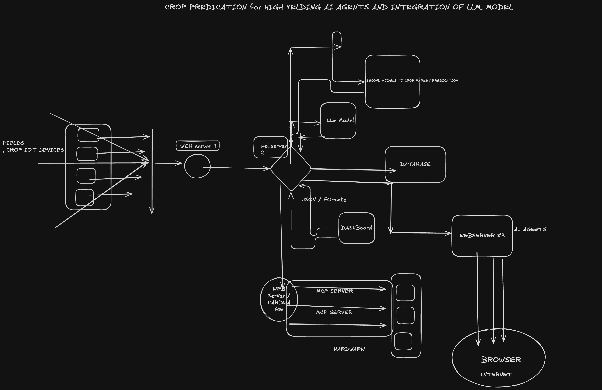

Live Architected :- https://www.youtube.com/live/LopXjHx907s?si=Jtxo-_Z5TFQjf_SS

# Crop Prediction System with High-Yielding AI Agents & LLM Integration

A modern, scalable architecture for **precision agriculture** that combines IoT field devices, real-time data streaming, Large Language Models (LLM), machine learning for crop/market prediction, interactive dashboards, autonomous AI agents, and hardware actuation (irrigation, spraying, etc.).

Designed for high-yield optimization in variable climates like Rajasthan, India.

## Architecture Overview

Distributed real-time pipeline:

- **IoT Edge** → Field sensors, robots & drones collect soil, weather, crop health data
- **Ingestion** → WebSocket-enabled WEB Server 2
- **Core Processing Hub** → Routes data to:
  - LLM Model (natural language insights, RAG with database)
  - Secondary ML models (yield & market forecasting)
- **Serialization** → JSON for interoperability
- **Visualization** → Real-time Dashboard
- **Decision & Actuation** → AI Agents on Webserver #3 → MCP Server → Hardware (actuators, robots)
- **Access** → Browser-based interface over internet

## Key Features

- Real-time bidirectional communication via WebSockets
- LLM-powered reasoning on unstructured + sensor data
- Parallel ML pipelines for yield and commodity market prediction
- Autonomous AI agents for decision-making and hardware control
- Modular, scalable web-server design
- JSON serialization for clean data exchange
- Dashboard visualizations for farmers & agronomists

## LLM & AI Integration

Leverages large language models for:

- Interpreting farmer notes, weather reports
- Generating actionable recommendations
- Enhancing retrieval-augmented generation (RAG) from database

## Autonomous AI Agents & Hardware

AI agents execute closed-loop control:

- Optimize irrigation, fertilization, pest control
- Command hardware via MCP (Microcontroller Protocol)
- Support reinforcement learning or rule-based autonomy

## Crop Market Prediction

Secondary models forecast prices using time-series analysis (e.g., historical commodity data).

## Tech Stack (Reference)

- **Backend**: Python (FastAPI / Flask), Node.js for WebSocket servers
- **AI/ML**: Hugging Face Transformers (LLM), scikit-learn / XGBoost / TensorFlow (secondary models)
- **Database**: PostgreSQL / TimescaleDB / MongoDB
- **Agents**: LangChain / LangGraph / CrewAI
- **Frontend/Dashboard**: React + Chart.js / Grafana / Streamlit
- **Hardware Interface**: Modbus/TCP, UART, MQTT
- **Deployment**: Docker, Kubernetes (recommended for scaling)

## Getting Started

1. Clone the repo (when available)
2. `docker-compose up` (future planned)
3. Configure IoT device endpoints and LLM API keys
4. Access dashboard at `http://localhost:3000`

## License

MIT License – feel free to adapt for your farm or agrotech project.

Built with precision agriculture in mind – especially useful in regions like Jaipur, Rajasthan (as of Jan 2025–2026 season).

Happy farming with AI! 🌾🤖
